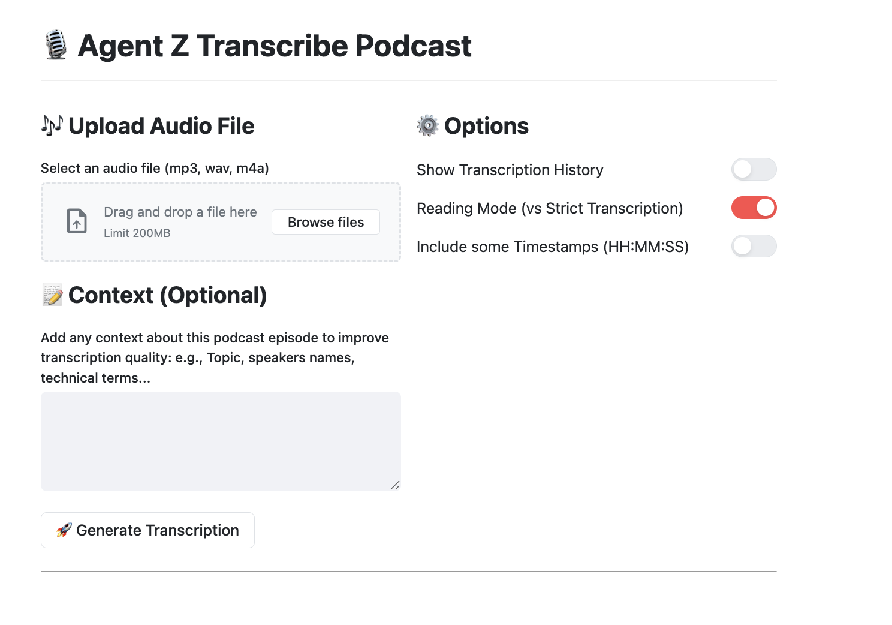

# 🤖 Agent Z transcribe podcast
<!-- ALL-CONTRIBUTORS-BADGE:START - Do not remove or modify this section -->
[](#contributors)
<!-- ALL-CONTRIBUTORS-BADGE:END -->

This is an IA Agent to transcribe podcasts to be easily readable as a book 🤘

## 🛠️ Configuration

1️⃣ Export these 2 variables:
```sh
export GOOGLE_GENAI_USE_VERTEXAI=FALSE
export GOOGLE_API_KEY=<your gemini API>
```

2️⃣ Create a `.env file`. The template `.env-template` in avaiable.

## ✨ Development

To run your agent (if you have only one specific agent):

```sh
mvn dependency:build-classpath -Dmdep.outputFile=cp.txt && java -cp target/classes:$(cat cp.txt) agents.AgentJavelitServer
```

To run the UI, run this command and go to ```http://localhost:8888```



## 🐳 Docker

This app could be runned with Docker and this command 
```
docker build -t agent-z-transcribe-podcast
docker run -p 8888:8888 -e PORT=8888  agent-z-transcribe-podcast
```

## 🚀 Deployment

To deploy on Cloud Run:

- authentification on GCP with `gcloud auth login`

- configure settings exporting variables:

```sh 
export GOOGLE_CLOUD_PROJECT=<your projet>
export GOOGLE_CLOUD_LOCATION=<location like europe-west1>
export GOOGLE_GENAI_USE_VERTEXAI=<true if you deploy on Google Cloud, else false>
export GOOGLE_API_KEY=<your GOOGLE API KEY>
```

or adding them into a `.env` file (cf `env-template` file)
```
export GCLOUD_PROJECT=
export GCLOUD_LOCATION=europe-west1
export GCLOUD_GENAI_USE_VERTEXAI=FALSE
export GOOGLE_API_KEY=
```

- and run the `gcloud` command.

```sh
gcloud run deploy agent-z-transcribe-podcast \
--source . \
--region $GCLOUD_LOCATION \
--project $GCLOUD_PROJECT \
--allow-unauthenticated \
--memory 1Gi \
--max-instances 1 \
--set-env-vars="GOOGLE_CLOUD_PROJECT=$GCLOUD_PROJECT,GOOGLE_CLOUD_LOCATION=$GCLOUD_LOCATION,GOOGLE_GENAI_USE_VERTEXAI=$GCLOUD_GENAI_USE_VERTEXAI,GOOGLE_API_KEY=$GOOGLE_API_KEY"

```


## ✨Contribute

Anyone can contribute to this project. For the moment, please add your question or purpose something in [a new issue](https://github.com/zenika-open-source/opensource-statistics/issues).


## 🙏 Contributors

<!-- ALL-CONTRIBUTORS-LIST:START - Do not remove or modify this section -->
<!-- prettier-ignore-start -->
<!-- markdownlint-disable -->
<table>
  <tbody>
    <tr>
      <td align="center" valign="top" width="14.28%"><a href="https://jeanphi-baconnais.gitlab.io/"><br /><sub><b>Jean-Phi Baconnais</b></sub></a></td>
      <td align="center" valign="top" width="14.28%"><a href="https://www.bbourgeois.dev"><br /><sub><b>Benjamin</b></sub></a></td>
      <td align="center" valign="top" width="14.28%"><a href="https://github.com/glefloch"><br /><sub><b>Guillaume Le Floch</b></sub></a></td>
    </tr>
  </tbody>
</table>

<!-- markdownlint-restore -->
<!-- prettier-ignore-end -->

<!-- ALL-CONTRIBUTORS-LIST:END -->


